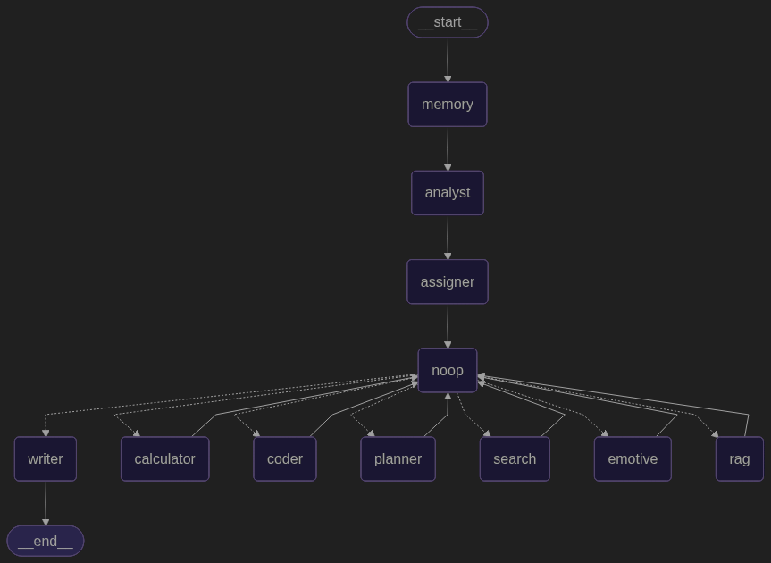

# AI Chatbot Project

An AI chatbot project built with FastAPI, LangChain, and other modern technologies. This project focuses on creating an intelligent chatbot capable of handling various tasks through specialized agents.


## Project Structure

```
├── src/
│   ├── agents/           # Specialized agents
│   ├── api/             # API endpoints
│   ├── config/          # Configuration
│   ├── static/          # Static files
│   ├── test/            # Unit tests
│   ├── tools/           # Support tools
│   ├── utils/           # Utilities
│   └── main.py         # Entry point
├── docker-compose.yml
├── Dockerfile
├── nginx.conf
├── requirements.txt
└── README.md
```


### Technologies Used
- 🤖 **AI/ML**: LangChain, LangGraph, TensorFlow, PyTorch, HuggingFace, SpaCy, Sentence Transformers, MCP, OpenCV
- 🌐 **APIs**: Together API, Gemini API, Google API  
- ⚙️ **Backend**: FastAPI, Nginx, Docker, PostgreSQL


## Multi-Agent Architecture

The chatbot is built on a Multi-Agent architecture, where each agent handles a specific role. Below are the details of the main agents in the system:



### Core Agents

#### 1. BaseAgent
- **Role**: Base class for all agents in the system
- **Functions**:
  - Initialize agent and manage tools
  - Integration with Google Generative AI (gemini-2.0-flash)
  - Build and manage state graph for processing flow within each agent
  - Coordinate processing flow between agents

#### 2. AssignerAgent
- **Role**: Analyze and route requests to appropriate agents
- **Assignment Logic**:
  - Writer: Simple requests (expression, rewriting, explanation)
  - Analyst: Complex requests (reasoning, analysis, problem-solving)
  - Coder: Programming-related requests, code, debugging
  - Planner: Planning and process requests
  - Search: Information lookup
  - Tool: External tool usage (API, file ops)
  - Vision: Image processing and OCR

#### 3. AnalystAgent

- **Role**: Deep analysis of user requests
- **Functions**:
  - Clarify and structure requests
  - Identify goals and expected outcomes
  - Analyze feasibility
  - Propose solution approaches

### Specialized Agents
#### 4. SearchAgent
- **Role**: Information search and synthesis
- **Functions**:
  - Search information from web or knowledge base
  - Filter and return relevant results
  - Cite information sources
  - No speculation, only data-based responses


#### 5. CoderAgent
- **Role**: Handle programming-related issues
- **Functions**:
  - Write and edit code
  - Debug errors
  - Performance optimization
  - Technical solution consulting

#### 6. PlannerAgent
- **Role**: Planning and strategy
- **Functions**:
  - Create detailed plans
  - Break down tasks into steps
  - Estimate time and resources
  - Track progress

#### 7. MemoryAgent
- **Role**: Memory and context management
- **Functions**:
  - Store important information
  - Maintain conversation context
  - Retrieve relevant information
  - Manage interaction history
  - Summarize context when it becomes too long

#### 8. WriterAgent
- **Role**: Content creation and editing
- **Functions**:
  - Write text based on requirements
  - Edit and optimize content
  - Create summary reports
  - Clear idea expression

#### 9. ToolAgent
- **Role**: External tool management and usage
- **Functions**:
  - Integration with external APIs
  - File system operations
  - Service connections (Gmail, Drive)
  - System task processing

#### 10. VisionAgent
- **Role**: Image-related task processing
- **Functions**:
  - Image analysis
  - Text recognition (OCR)
  - Image processing and editing
  - Image generation and adjustment

### Request Processing Flow

1. **Initialization**:
   - All requests start from `MemoryAgent`
   - `MemoryAgent` stores context and summarizes if context is too long for `AssignerAgent`

2. **Task Assignment**:
   - `AssignerAgent` analyzes request and determines appropriate agent
   - Based on request type, routes to one of the agents:
     - Analyst (complex analysis)
     - Writer (simple tasks)
     - Coder (code-related)
     - Planner (planning)
     - Search (information lookup)
     - Tool (tool usage)
     - Vision (image processing)

3. **Specialized Processing**:
   - Each agent processes according to its expertise
   - `AnalystAgent` transfers results to `SupervisorAgent` after analysis
   - `SupervisorAgent` decides which agent to route to and if user intervention is needed:
     - Routes to `CalculatorAgent` if calculations needed
     - Or routes to `WriterAgent` for response

4. **Process Completion**:
   - All agents transfer final results to `WriterAgent`
   - `WriterAgent` formats and returns final response

### Architecture Advantages

1. **Modular and Extensible**:
   - Each agent operates independently
   - Easy to add new agents
   - No impact on other agents during upgrades

2. **Specialization**:
   - Each agent focuses on specific tasks
   - Optimization for each task type
   - Easy to improve individual aspects

3. **Processing Flexibility**:
   - Adjustable processing flow based on requirements
   - Supports parallel processing when needed
   - Easy to add new processing steps

4. **Efficient State Management**:
   - Uses StateGraph for flow management
   - Stores and tracks processing progress
   - Easy debugging and troubleshooting

## System Requirements

- Python 3.12+
- Docker and Docker Compose
- Nginx (for production)

## Installation

1. Clone repository:
```bash
git clone https://github.com/trongdung143/chatbot.git
cd chatbot
```

2. Create virtual environment and install dependencies:
```bash
python -m venv venv

source venv/bin/activate  # Linux/Mac
.\venv\Scripts\activate  # Windows

pip install -r requirements.txt
```

3. Configure environment:
- Create `.env` file from template and update environment variables

## Running the Application

### Development

```bash
uvicorn src.main:app --reload --host 0.0.0.0 --port 8000
```

### Production with Docker

```bash
docker-compose up -d
```

Application will be available at: http://localhost:8000
